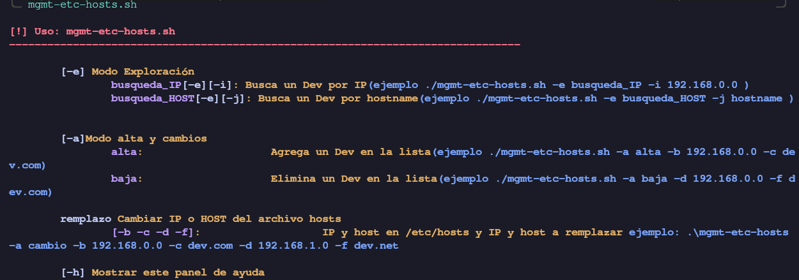
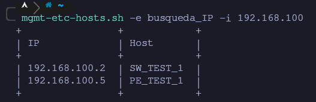
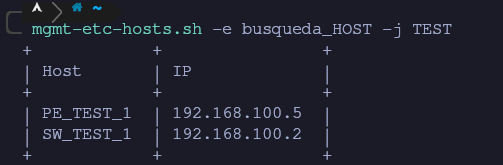

<!--------------------------------------+-------------------------------------->
# mgmt-etc-hosts
<!--------------------------------------+-------------------------------------->
Como es bien conocido, el archivo hosts sirve para generar una correspondencia 
entre dominios y las direcciones IP.
Utilizando esta función, se me ocurrió, como administrador de **Redes**, utilizar
este archivo para administrar los diferentes routers y switches, relacionando 
los hostname y las IPs de estos.

Inicialmente empece editando y modificando manualmente el archivo **hosts**, al inicio
todo fue bien, pero entre más dispositivos existían en la Network, se fue haciendo más
complicado el administrar este archivo. Esto genero la idea de crear un script que 
facilitara la búsqueda, alta o bajas en **etc/hosts**, para poder combinarlo con ssh y/o telnet


<!--------------------------------------+-------------------------------------->
## 								Descripción General
<!--------------------------------------+-------------------------------------->
 
 ### **Instalar la el script**
 La aplicación esta pensada para ejecutar como root, pero si tu necesidad es poder 
 ejecutarlo como usuario, necesitaras realizar los siguientes cambios.
 ```
 chmod o+w /etc/hosts
 ```
Para poder ejecutarlo desde cualquier parte, tendrás que agregarlo al **PATH**, podrías agregarlo en el 
**.local/bin/**, o en la ruta de tu preferencia. 
Para consultar el PATH basta con ejecutar ```echo $PATH"```, posteriormente puedes ejecutar la siguiente secuencia de comandados, para dejarlo funcional
```
chmod u+x mgmt-etc-hosts.sh

sudo mv mgmt-etc-hosts.sh ~/.local/bin/mgmt-etc-hosts.sh  
mgmt-etc-hosts.sh -h
```
### Forma de uso
|Script 		   |Argumento 									| Descripción			|
|------------------|--------------------------------------------|-----------------------|
|mgmt-etc-hosts.sh |-h 		  									|Panel de ayuda			| 
|mgmt-etc-hosts.sh |-e busqueda_IP -i 192.168.100.2 			|Búsqueda por IP 		| 
|mgmt-etc-hosts.sh |-e busqueda_IP -j SW_TEST_2 				|Búsqueda por HOSTS		|
|mgmt-etc-hosts.sh |-a alta -b 192.168.100.2 -c SW_TEST_2		|Alta de un Hosts 		|
|mgmt-etc-hosts.sh |-a baja -d 192.168.100.2 -f SW_TEST_2		|Baja de un Hosts 		|
|mgmt-etc-hosts.sh |-a cambio -b IP -c hostname -d IPn -f hostN	|Cambio de nombre o IP 	|

### Screenshots


**Panel de Ayuda**


**Busqueda por IP**


**Busqueda Por Host**


**Alta de un Host**


**Baja de un Hosts**


**Cambio de IP o Hosts a una entrada existente**

##### Espero que te sea de utilidad este script, si es el caso apoyame con haciendo "★ Star" en este repositorio.¡Gracias!

## Hola, me cononcen como Syncophat.
Soy ingeniro en Telecomunicaciónes desde el 2013. Hoy en día busco compartir mi experiencia, así como herramientas enfocadas al mundo del telecom.

Así como a mi, espero que a ustede tambien les ayuden y les facilite sus actividades.


